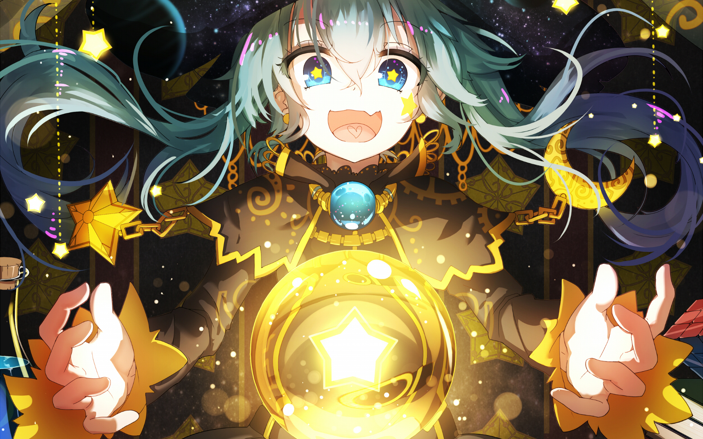

<picture>
    
</picture>

<h1 align="center">
  🌟 Hi! I'm Phuong Dong 🌟
</h1>

<!-- Make with: https://readme-typing-svg.demolab.com/demo/ -->

<!-- - 🌱 I’m currently learning AI, ML, DL and making some interesting projects about them
- ⛩️ I extremely love Anime and Anime Arts and my projects mainly focus them -->

<h2 align="left">My Github's Stats</h2>

<h2 align="left">Connect</h2>

 &nbsp  &nbsp  &nbsp 

<!-- <h2 align="left">Contributions</h2>

<picture>
  
</picture> -->

<!--
<h2 align="left">Chilling Corner</h2>

<table max-width="100%" style="width: 100%">
    <tr>
      <th style="text-align: center">Anilist Corner</th>
      <th style="text-align: center">Waifu Corner</th>
    </tr>
    <tr>
      <td>
        <picture>
          
        </picture>
      </td>
      <td width="32%">
<!--START_SECTION:update_image-->
<!--
<picture>
                    
                  </picture>
                   
                  <picture>
                    
                  </picture>
                   
                  <picture>
                    
                  </picture>
<!--END_SECTION:update_image
</td>
    </tr>
</table>
-->
